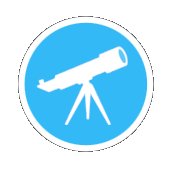
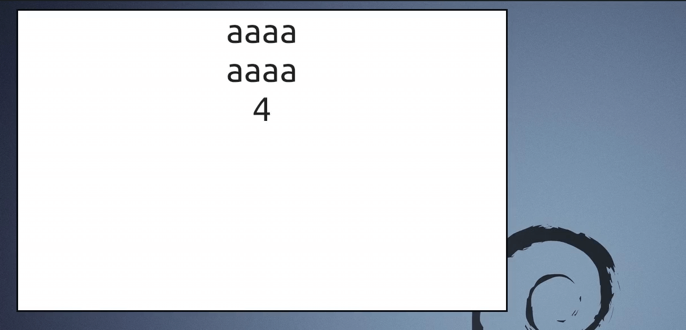

# Telescope
 <br>
Just another state manager for flutter based on observable design pattern which is in <b>Beta</b> yet.

Telescope Trys to be:
1. Easy to use.
2. Flexible.
3. Make it harder to make bugs.
4. Performance (just rebuild parts that need to rebuild).
5. No setState() needed.


# how to use
In 3 easy steps.

## 1. Make a telescope :
Recommended to put it in view model class but its depends on you.
```dart
  static var textValue = Telescope("");
```

## 2. Watch(this):
Put this in middle of you widget build function.<br>
You can watch single telescope in multiple widget
```dart
  @override
  Widget build(BuildContext context) {

    var style = const TextStyle(fontSize: 60);
    print("build");
    return Material(
        type: MaterialType.transparency,
        child: SafeArea(
            child: Container(
              color: Colors.white,
              child: Column(children: [
                Text(textValue.watch(this),style: style), // like this
                Text(textValue.watch(this),style: style), // can use in multiple times
                Text(textValue.watch(this).length.toString(),style: style),
              ],),
            )
        )
    );
```

## 3. Update value:
You can update telescope.value from anywhere from your codes:

```dart
  Timer.periodic(const Duration(milliseconds: 1000), (timer) {
    TextSampleState.textValue.value += "a";
  });
```

## Boom:

 <br>

# Depends on:
Telescopes can be depends on other telescopes

```dart
  static var height = Telescope(187);
  static var weight = Telescope(70);

  // BMI = (Weight in Kilograms / (Height in Meters x Height in Meters))
  static var bmi = Telescope(0.0).dependOn([height,weight], () {
    return weight.value / ((height.value/100) * (height.value/100));
  });

  static var showingText = Telescope("").dependOn([bmi], (){
    return "weight is ${weight.value} and height is ${height.value} so bmi will be ${bmi.value.toString().substring(0,5)}";
  });
```

# TODO

- [ ] telescope list sample
- [ ] telescope map
- [ ] telescope set
- [ ] build in ORM